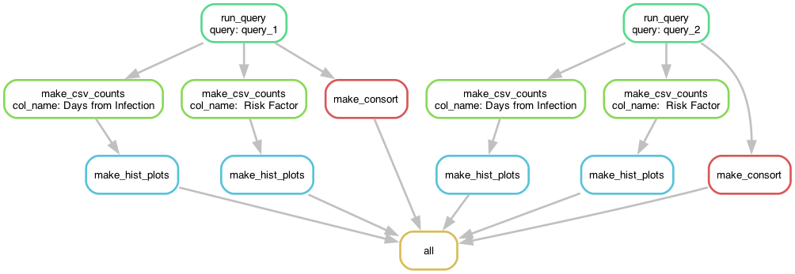

# **Overview**

Sarah still TODO:
+ fix snakemake output!
    + replace bash output with snakemake output once fixed!
    + fix manual addition of Days from Infection, Risk Factor?
+ need to finish google big query tests

Other group TODOs:
+ listed a few throughout, always starting with TODO!

### **Scientific Background**

The challenge of curing HIV:

+ 1.5 million new infections/year 
+ 42 years since first known cases
+ Current therapies involve taking daily medication
+ We want a vaccine instead

Sequences can help! Why? 

+ Early sequences are more helpful because 
    they represent virus fit enough to transmit and infect a new individual.
+ We can identify countries/geographic areas
    facing a new mutation in the HIV virus
+ We can understand how differences in the virus
    correspond to differences in clinical outcomes

The Los Alamos National Laboratory HIV Database contains over 1 million
HIV genetic sequences along with comprehensive metadata. It is a goverment-
funded database that is updated biweekly to monthly, and it includes
information about genetic HIV sequences including where they were isolated,
health status of the patient infected, year when collected, virus subtype,
and more. The database can be queried manually at the following link:

https://www.hiv.lanl.gov/components/sequence/HIV/search/search.html

This software is intended as a first step to query investigations,
to understand the number of viral sequences available based on a particular query.
While the LANL database is extremely important, bias can also arrive from
inconsistent or unequal sampling.

### **Project Rationale**

This project aims to provide the code needed to summarize database query
selections from the Los Alamos HIV Sequence Database. Although the database
can be queried manually at the link included above, this is not necessarily
ideal and can lead to unwanted biases. Our repository aims to filter the
large dataset based on a number of search criteria, then create several plots
based on that search. The goal is to offer the user a better understanding of
the data available in the database before deciding what to download, as well
as to offer an understanding of how different filtering choices would affect
how many and which entries from the dataset are downloaded. 

**What is the problem with manual queries?**

Manual queries require that the user define the query without having
an idea of the distribution of information that is availabe. Additionally,
they are not very reproducible. 

**Why is this important?**

+ Understanding of data availability for research questions
+ Understanding of research gaps and need for novel research
+ Removing unwanted biases in data download from large public portals
+ Improving reproducibility of searching and data download

**Goal: Understand available data**

Develop a codebase to summarize data from the HIV database:

+ Visualize the available metadata included with genetic sequences
+ Allow for better selection of sequences for download
+ Improve understanding of how query choices narrow available data

Example consort plot of how query selections filtered data:


Example distribution of values in query filters:


**Reach Goal: Automate visualization and searching**

Automation that allows user to select filtering criteria and receive
all outputs of the codebase - consort and distribution plots, as well
as additional files summarizing query, query results, and sequence IDs.

### **Project Function**

The project's overall goal function is described by the following figure:


# **Installation**

The project source code is written in Python3 and designed to be run
either as separate functions called from the command line in bash, or
all together as a snakemake workflow. Example bash scripts are
included in each subdirectory of src/ with examples for running each
python function, and an example snakefile is included in workflow/.

### **Dependencies**

**Conda Environment with all Dependencies**

A conda environment file with all of the necessary dependencies to
run the source code has been provided at etc/csci6118_env.yml. To create
a new conda environment from this file and then activate that environment,
you can run the following:

```bash
conda env create --file etc/csci6118_env.yml
conda activate csic6118_env
```

**Detailed List of Dependencies**

Python3, bash, and R are required to run the code in this project.

The dependencies for Python3 are:
+ numpy
+ pandas
+ pandas-gbq
+ matplotlib

You can install these with the following code within the terminal:

## TODO: do we want to remove this section since they could just use
the conda environment instead?

``` bash
conda install numpy pandas matplotlib
```

The dependencies for R are:
+ ggplot2 (or tidyverse)
+ dplyr (or tidyverse)
+ janitor
+ rpy2

You can install these with the following code within the terminal:

## TODO: remove this too?
``` bash
Rscript -e "install.packages(c('janitor', 'dplyr', 'ggplot2'), repos='https://cran.rstudio.com')"

# or with conda:
conda install r-janitor r-tidyverse rpy2
```

The dependencies for snakemake and visualization of the snakemake diagram are:
+ snakemake
+ graphviz

You can install these with the following code within the terminal:
## TODO: remove this too?
```bash
conda install snakemake graphviz
```

Finally, there are additional dependencies that need to be installed
using conda:
## TODO: remove this too?
```bash
conda install ca-certificates certifi openssl

```

### **Step by Step Installation Instructions**

1. Clone this repository to your local machine:

```bash
git clone git@github.com:sdslack/csci_6118_project.git
```

2. Navigate to the directory containing the cloned repository:

```bash
cd csci_6118_project
```

3. View the contents of the repository:

```bash
ls
```
```
LICENSE  README.md  docs  docs_snakemake  etc  src  test  workflow
```

This document is the README.md, docs/ contains any data or plots written
out by the currently implemented code, src/ contains the source code
for this project, and test/ contains the unit and functional tests. The
workflow/ directory contains the snakefile for snakemake automation, and
the etc/ directory contains the conda environment recipe file with all
dependencies and Google service account access to the BigQuery hosted
LANL sequence metadata.

4. The subset of test data download from the Los Alamos HIV Sequence
    Database is located at test/data/LANL_HIV1_2023_seq_metadata.csv.

5. The src/ directory is currently split so that each team member has a
    separate folder. Each of these folders contain bash scripts with
    examples for how to run that portion of the code.

```bash
cd src/sdslack
bash sds_test_run.sh
```
    Nothing is printed upon successful execution, but a plot is added to the
    test/data/output folder, named according to the column that was selected.


# **Testing**

Unit tests are located at test/unit and functional tests (which use the Stupid
Simple Bash Testing Framework) are loated at test/func. They can be run from
inside each respective directory, and are not currently implemented to
automatically run.

Unit tests can be run with the following code:

```bash
cd /test/unit
python -m unittest test_sds_utils.py
```

Functional tests can be run with the following code:

```bash
cd /test/func
bash test_sds_utils.sh
```

Style tests for python (PEP8, tested using pycodestyle), are executed when
any branch is pushed to the GitHub-hosted repository as well as when a pull
request is made on the main branch on GitHub. The code that runs these tests
is located at .github/workflows/tests.yml. In order to run pycodestyle, the
tests automatically set up a mamba environment "csci6118" using an environment
file at test/etc/csci6118_env.yml

# **Usage**

### **Snakemake Automation**

The codebase can be run in an automated fashion using the snakefile located
at workflow/snakefile. It can be run with the following code:

```bash
cd workflow
snakemake -c1

```

*To note: -c# controls how many cores are used. For automation of multiple*
*queries at the same time, multiple cores can be used to run each query*
*in parallel.*

The following diagram shows the steps executed when running the snakemake
pipeline:



A user can edit the top of the snakefile to run as many user-defined
queries as desired. The portion of the file to edit is show here:

```
# TO NOTE: User edit to define query (or queries) between here and dashed line:
# Set up days from infection filter
num_list = "=0" + "".join(f",={i}" for i in range(1, 91))

# Define QUERIES dictionary, adding new entry to each desired query
QUERIES = {
    'query_1': f"Days from Infection:{num_list}; Risk Factor:=IV Drug User",
    'query_2': f"Days from Infection:{num_list}; Risk Factor:=Male Sex with Male, =Sex worker, =Heterosexual"
}

# -----------------------------------------------------------------------------------------
```

The column names available to be queried or output from the full dataset hosted
on Google BigQuery are:

```
"#"                         "Patient Id"                "Patient Code"             
"Patient Sex"               "Risk Factor"               "Infection Country"        
"Infection City"            "Infection Year"            "Patient comment"          
"HLA type"                  "Project"                   "Patient ethnicity"        
"Progression"               "# of patient seqs"         "# of patient timepoints"  
"Species"                   "SE id(SSAM)"               "PAT id(SSAM)"             
"Name"                      "Locus Name"                "Isolate Name"             
"Clone Name"                "Georegion"                 "Country"                  
"Sampling City"             "Sampling Year"             "Sampling Year Upper"      
"Patient Age"               "Patient Health"            "Organism"                 
"Subtype"                   "Phenotype"                 "Coreceptor"               
"Sample Tissue"             "Culture Method"            "Molecule type"            
"Drug Naive"                "Problematic Sequence"      "Viral load"               
"CD4 count"                 "CD8 count"                 "Days from Infection"      
"Days from Seroconversion"  "Days from first Sample"    "Sequencing method"        
"Amplification strategy"    "Fiebig Stage"              "Anno"                     
"Days from treatment start" "Days from treatment end"   "Vaccine status"           
"RIP subtype"               "SE id(SA)"                 "Accession"                
"GI number"                 "Version"  
```

More detailed explanation on how to use these column names with filter parameters
is given in the section focused on the querying code.

### **Examples**

Inside each team member's folder in src/, there is a bash script that can be
run as an example to execute the code. For example:

```bash
cd src/lkr
bash run.sh
```

```bash
cd src/jb
bash run_query_data.sh
```

```bash
cd src/gg
bash run.sh
```

# **Functions**

### **Plotting Code**

**src/gg**

Within the src/gg folder, all scripts help create 
    a .png file containing a consort diagram. This diagram helps explain
    which sequences were excluded or included based on given search criteria.
    A run.sh file has been provided as an example.
    The scripts must be run in the following order:
    1. query_functions.py to allow for creation of important functions
        There are two different functions within this file.
        subset_dataframe_by_names() will subset a dataset by column name.
        output_query_summary() changes the query.csv file to reflect
            query parameters.
    2. make_query.py to create queries for the database
    3. data_subsetting.py to prepare the data for the R scropt
    4. consort_plot.r which will generate the consort plot
    
**src/sds**

**Histogram plotting code:**

In the src/sds folder, sds_test_run.sh runs three examples of the histogram
plotting code - one summarizing a query column with integer values, one
with float values, and one with string values. The code can also plot mixed
types within one column, although an example is not shown for that.

The test bash script can be run as follows:

```bash
cd src/sds
bash sds_test_run.sh
```

This will run plot_hist.py three times with the inputs given in the bash
script (the path to each of the three test counts files made by the code
in src/lkr). The help information for query_categ_plot.py clarifies this:

``` bash
python plot_hist.py --help
```

```
usage: plot_hist [-h] --file-name FILE_NAME --plot-output PLOT_OUTPUT

Uses counts of values from query column to plot histogram showing distribution of those values.

options:
  -h, --help            show this help message and exit
  --file-name FILE_NAME
                        Name of the data file to read. Expects counts of values from query column as output by LKR, with unique values from queried column in first column and
                        counts of those values insecond column
  --plot-output PLOT_OUTPUT
                        Path to write output plot to
```

The plot_hist.py script calls on the functions in sds_utils.py:

+ get_counts - reads counts of values from query column in format output
    by src/lkr into dataframe
+ plot_hist - plots a histogram of values passed in

The docustring for these functions can be accessed with the following code:

```bash
cd src/sds
python
import sds_utils
sds_utils.get_counts.__doc__
sds_utils.plot_hist.__doc__
```

```bash
# For get_counts
Reads the given CSV file with counts of values from query
column into a pandas dataframe, in format output by src/lkr.

Parameters
----------
file_name : str
    Name of the file to query

Returns
-------
counts : pandas dataframe
    Dataframe of given CSV file with counts of column values

# For plot_hist
Plots histogram of given counts

Parameters
----------
counts_df : pandas dataframe
    Dataframe of given CSV file with counts of column values
output_path : str
    Path to write output plot to
```

**Pandas Google BigQuery code:**

The gbq_utils.py script is optionally used by jb/get_queried_data.py to
query the entire set of metadata for sequences availabe on the LANL database,
stored on Google BigQuery. Storing the metadata on BigQuery allows the use
of panda-gbq to only download columns of interest to the user, instead of
downloading all columns.

The only function in gbq_utils.py is get_gbq_data. Its docustring contains
the following:

```
Uses pandas-gbq to download only columns of interest from the table stored
on Google BigQuery. Uses a service account with access limited to only the
sequence database dataset.
```

### **Querying Code**

**src/jb**

In the jb folder within the source folder, is the query_data.py script that will execute the main querying functionalities for the data. The code will essentially query an inputted data file based on provided querying filters for the data and then output a csv file of the filtered data. The way filter criteria are inputted must follow the correct format. 

- For the filter parameters, inputs must be provided in quotations when providing multiple filters.
- Each individual variable to be filtered must be written with a semicolon in between the name of variable and filter criteria/value like this --> "col_name:value1"
- If there are multiple variables to be filtered, then each different variable must be separated with a ; --> "col_name1:value1 ; col_name2:value2"
- If the variable/column(s) to be filtered are not in the data frame or has been typed incorrectly, the code will query only the columns found in the dataframe and spit out a message indicating which columns where not in the found. 
- Criteria for each column separated by a comma will be interpreted as OR operations UNLESS there are multiple != statements which will be read as AND operations.
    

The code will take in four main parameters:

# TODO: Sarah made the --file parameter optional, so if not given the code
# automatically queries the entire dataset on Google BigQuery. It also looks
# like there are more parameters now too? Might be worth printing out the help
# function (exampel above in SDS section). 

1. --file: Name of file and path to file
    - Only takes in a csv.
2. --filters: Filters for any variables both categorical and numerical. 
    - This is not a required filter.
    - This parameter also takes in the input as a string. 
    - Both numerical and categorical filters can be taken as:
        - Numerical: 
            - a range (inclusive) --> "col_name:0-7"
            - an inequality (inclusive or exclusive) --> "col_name:>=7" or "col_name:<=7" or "col_name:>7" or "col_name:<7"
            - a single numerical number --> "col_name:=7"
            - not equal to a certain number --> "col_name: !=7"
        - Categorical: 
            - single values equal to --> "col_name: =United States"
            - single values not equal to --> "col_name: !=United States"
    - The code can also take multiple variable filter criteria for each individual variable to filter and must be separated by a comma --> "col_name1:=7,9-15,>20 ; col_name2:Europe,United States"
    - Multiple column filters need to be separated by ;
4. --query_output_file: Name of output file and path to file
    - File is written out as a csv.
5. --output_columns: Names of the columns that will be outputted to the queried data file.
    - This is not a required field.
    - If not provided, the code will output all of the columns in the data frame.
    - If provided, columns need to be comma separated.
6. --query_request_file: Name of query request summary and path to file
    - File is written out as csv.
7. --global_logical_operator: The logical operator (&& or ||) that is used to describe how to filter between columns.
    - Takes in either && or ||
    - Example --> --filter: "col1: =3; col2: <5" --global_logical_operator '&&'
        - This example will output a filtered dataset where all rows are both =3 in col1 and <5 in col2.


**Example Input**
This is an example to show ways input can be written. This can be used on the test data file but will come up with nothing and there are a limited number of examples that can be provided with this many filters since the data file is small. 
```
python query_data.py --file ../../test/data/LANL_HIV1_2023_seq_metadata.csv 
--filters "Subtype:=B,=35_A1D ; Georegion: =North America ; Sequence Length:1035-2025,<915 ; Percent non-ACGT:=0.0" --output_file ../../doc/filtered_data.csv --output_columns "Sequence Length, Sequence" --query_request_file ../../doc/query_summary_request.csv --global_logical_operator "||"
```
